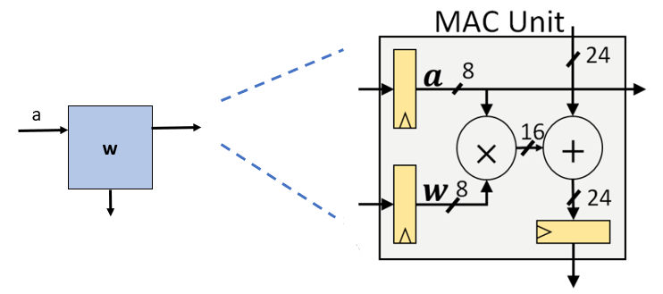
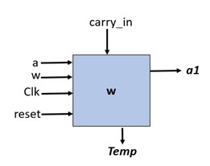
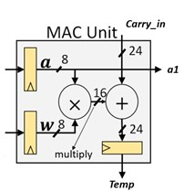
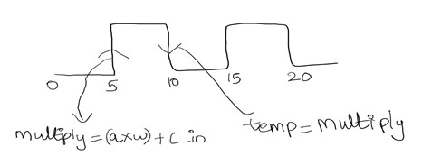

# 4x4 Systolic Array Implementation

## Overview

This project implements a 4x4 systolic array, a hardware architecture designed for efficient matrix multiplication. It simulates a simplified version of Google's Tensor Processing Unit (TPU). The project utilizes Verilog RTL for design and Cadence XCelium for verification.

## Key Features

* **4x4 Systolic Array:** Implements matrix multiplication using a 4x4 array of Multiply-and-Accumulate (MAC) units.
* **Multiply-and-Accumulate (MAC) Unit:** Performs 8-bit multiplication and 24-bit accumulation.
* **Synchronous Design:** Controlled by a single global clock ("clk") and asynchronous reset ("rst").
* **8-bit Input Quantization:** Reduces 24-bit partial sums to 8-bit values.
* **Activation Unit:** Applies non-linear transformations to the quantized outputs.
* **Functional Verification:** Verified using a testbench at 100 MHz and Cadence XCelium.
* **Matrix Multiplication Demonstration:** Demonstrates the multiplication of two 4x4 matrices as specified in the midterm exam.

## Design Components

* **MAC Unit:**
 

* **Function:** The MAC unit is the fundamental building block, responsible for multiplying two 8-bit inputs ('a' and 'w') and adding the result to a 24-bit 'carry_in' value.
 

 
* **Inputs:**
    * 'a': 8-bit input.
    * 'w': 8-bit input.
    * 'clock': 1-bit clock signal.
    * 'reset': 1-bit asynchronous reset signal.
    * 'carry_in': 24-bit partial sum input.

* **Outputs:**
    * 'a1': 8-bit output (likely a delayed or processed version of 'a').
    * 'temp': 24-bit output, storing the result of the multiplication and addition.
    
* **Internal Operation:**
 

    * A 24-bit register within the MAC unit stores the intermediate result.
    
    * On the positive edge (posedge) of the clock, the multiplication ('a' * 'w') and addition of 'carry_in' is performed.
    * On the negative edge (negedge) of the clock, the computed value is transferred to the 'temp' output register.

  

* **Systolic Array:**
    * 4x4 array of interconnected MAC units.
    * Implements the matrix multiplication algorithm.
* **Quantization Unit:**
    * Thresholds 24-bit partial sums to 8-bit values.
* **Activation Unit:**
    * Applies non-linear transformations to the quantized outputs.

## Simulation Results

* **Functional Verification:**
    * The testbench simulates the multiplication of two 4x4 matrices.
    * Cadence XCelium simulations confirm the correct operation of the design.
    * **Matrix Multiplication Results:** As shown in the "Midterm Report (1).pdf" the simulation shows the changes in memory across clock cycles.
    * Example results from the report:
        * sum4[23:0] changes to 27
        * sum8[23:0] changes to 40
        * sum12[23:0] changes to 14
        * sum16[23:0] changes to 8
    * The report contains the waveforms of the simulation.

## Usage

1.  **Simulation:**
    * Use the provided testbench files to simulate the design.
    * Cadence XCelium can be used for more detailed simulations.
2.  **Verification:**
    * Review the simulation results in the "Midterm Report (1).pdf".

## Project Structure

* **rtl/**: Contains the Verilog RTL code for the MAC unit and systolic array.
* **testbench/**: Includes the Verilog testbench for simulation.
* **docs/**: Contains the "Midterm Report (1).pdf" with simulation results.

## Acknowledgments

This project was completed as a midterm exam for the IECE421/521: Digital ASIC Design course at the University at Albany with Dr. Seetal Potluri.

## Contact

For any questions or further information, please contact: Akhil Reddy Gujju.
